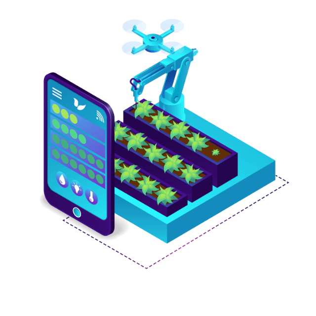

# Agri_Computer_Vision
Robotics, Photogrammetry &amp; UAV Crop Analysis Projects

  <h1>🌾 UAV & Robotics for Smart Agriculture 🌾</h1>
  <table>
    <tr>
      <td>
        
      </td>
      <td>
        
      </td>
      <td>
        
      </td>
    </tr>
  </table>

## 👋 About Experience
Robotics enthusiast specializing in:
- Disease Detection using UAV Imagery
- Plant Stand Count & Yield Estimation
- Precision & Spot Spraying

**Skills:** |Robotics and AI Researcher | UAV Engineer|ROS 2 Developer| Computer Vision| Deep Learning in Precision Agriculture| Drone Flight Control Engineer|

## 🚀 Featured Projects
- **Disease Detection using UAV Imagery** — [Link to repo]
- **Plant Stand Count & Yield Estimation** — [Link to repo]
- **Precision Spraying & Spot Spraying** — [Link to repo]

## 🛠️ Tools & Technologies

-22314E?style=for-the-badge&logo=ros&logoColor=white)

## 📊 GitHub Stats

## 🔗 Connect
[LinkedIn](https://www.linkedin.com/in/anwar-iqbal59/) | [Portfolio](your-link)

